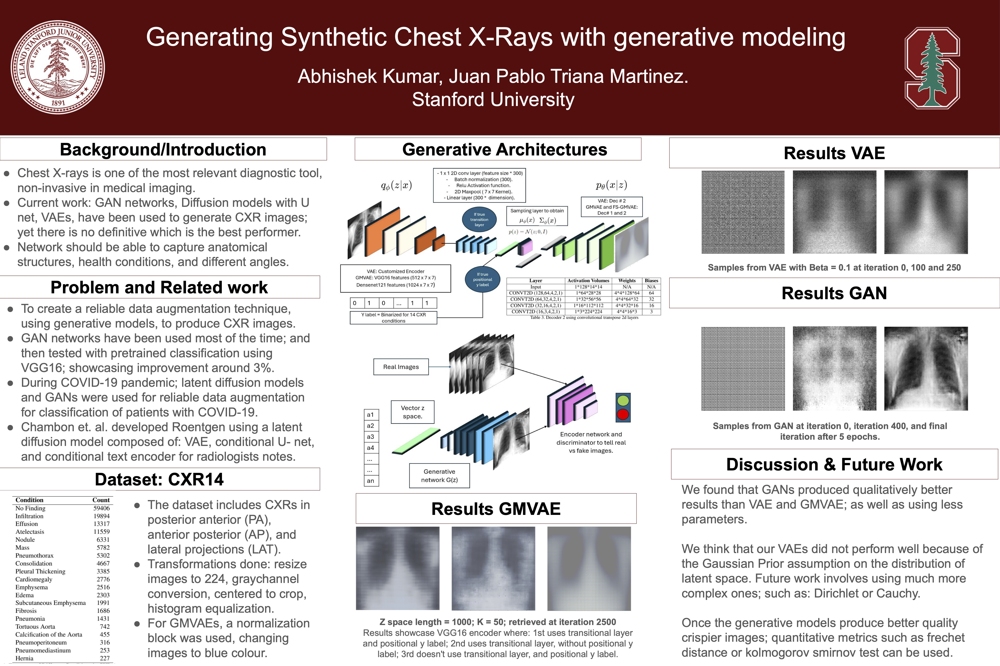

### Abstract
In the field of medical imaging, accurate classification of Chest X-rays (CXRs) is vital for timely and effective diagnosis. The advances of Deep Learning in Computer Vision has enabled the possibility to build CAD (Computer Aided Diagnosis) systems, which can assist the radiologists with CXR diagnosis. However, medical imaging datasets like CXR images are limited in size and availability due to privacy concerns. Due to the diversity of health conditions, anatomical structures, and different angles of the X-rays (posterior-anterior, anterior-posterior, lateral) simple image augmentation methods, such as rotation, flipping, varying lighting etc. would not capture the biological variance, resulting in genera- tion of unrealistic images. Recently, using generative models to augment datasets using synthetic X-rays, have shown to improve classification in multiple studies. In this study, we explore three generative algorithms, Variational Autoencoders (VAE), Gaussian Mixture Variational Autoencoders (GMVAE), and Generative Adversarial Networks (GAN), for generating synthetic chest X-ray images.

### Report
[You can download the report here](cs231_report.pdf)

### Presentation
[You can watch the presentation here](https://www.youtube.com/watch?v=cKdiDw5Vsms)

### Poster

### Reposiory Structure
1. The datasets can be downloaded from Kaggle. [Link](https://www.kaggle.com/datasets/nih-chest-xrays/data)
1. The code to train the GAN network (our best network) can be found in `src/gan.py`